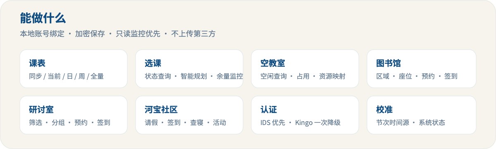
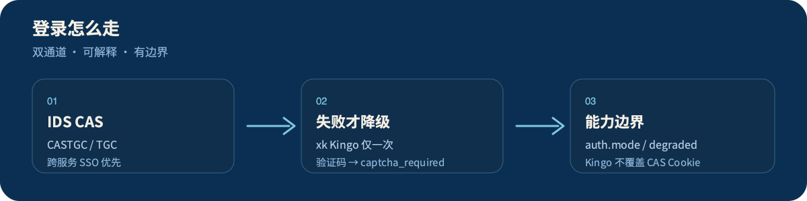

<p align="center">
  
</p>

**河南大学学生**本地可用的校园助手。同一套能力，按场景拆成三条独立分支：

| 你想… | 用这个 | 分支 |
| --- | --- | --- |
| 接 MCP 客户端 / 二次集成 | MCP 服务器 | [`mcp-server`](https://github.com/jry21223/HENU_Assistant/tree/mcp-server) |
| 接 QQ / Langbot，多用户隔离 | Langbot 插件 | [`langbot-plugin`](https://github.com/jry21223/HENU_Assistant/tree/langbot-plugin) |
| 当 Agent Skill / 本地 CLI | Agent Skill | [`agent-skill`](https://github.com/jry21223/HENU_Assistant/tree/agent-skill) |

> `main` 是项目首页与文档入口；**可运行代码在对应分支**，不要在 `main` 里找完整业务实现。

---

## 先看结果

<p align="center">
  
</p>

| 能力 | 实际能做什么 |
| --- | --- |
| 账号 / 系统 | 绑定学号密码、本地加密保存、系统状态 |
| 课表 | 同步与查询（当前 / 日 / 周 / 全量） |
| 选课 | 状态查询、智能规划、只读余量监控（可提醒） |
| 空教室 / 资源 | 空闲与占用查询、资源映射 |
| 图书馆 | 区域、座位、预约、签到、取消 |
| 研讨室 | 筛选、成员组、预约、签到、取消 |
| 河宝社区 | 请假、签到、查寝、活动、信息收集等查询 |
| 节次校准 | 校准课表节次时间源 |

**想直接体验部署版**：加 QQ 群 `1031855485`

<p align="center">
  
</p>

<details>
<summary>「毒瘤名单」（半认真）</summary>

- [x] 今日校园
- [x] 喜鹊
- [ ] 多彩校园 / 水满分
- [ ] 体适能

</details>

---

## 它和“又一个脚本”差在哪

1. **三种交付形态**共享校园能力，而不是各写各的。  
2. **登录策略可解释**：IDS 优先，失败才 **一次** Kingo 降级；不识别验证码、不循环重试。  
3. **数据默认本地**：账号、Cookie、缓存不上传第三方；Langbot 版按 QQ 隔离。  
4. **选课监控只读**：提醒余量变化，不代替你点选课 / 退选。

<p align="center">
  
</p>

**Kingo 降级边界**：主要保证课表 / 选课状态 / 空教室等 xk 能力；图书馆、研讨室、河宝仍需 IDS。相关接口通过 `auth` 返回 `mode`、`degraded`、`error_code`、`warning`。

---

## 30 秒上手

### Langbot 插件

```bash
git clone -b langbot-plugin https://github.com/jry21223/HENU_Assistant.git
cd HENU_Assistant
python3 -m venv .venv
.venv/bin/pip install -r requirements.txt
.venv/bin/lbp build   # 或 .venv/bin/lbp run
```

### MCP 服务器

```bash
git clone -b mcp-server https://github.com/jry21223/HENU_Assistant.git
cd HENU_Assistant
python3 -m venv venv
source venv/bin/activate          # Windows: venv\Scripts\activate
pip install -r requirements.txt
python3 diagnose_mcp.py           # 可选
python3 mcp_server.py --transport stdio
```

### Agent Skill

```bash
git clone -b agent-skill https://github.com/jry21223/HENU_Assistant.git henu_campus_assistant
cp -r henu_campus_assistant ~/.openclaw/workspace/skills/
cd ~/.openclaw/workspace/skills/henu_campus_assistant
python3 -m venv .venv
.venv/bin/pip install -r requirements.txt
.venv/bin/python henu_cli.py system_status
```

各分支 README 含工具列表、CLI 示例与存储路径说明。

---

## 文档

| 文档 | 说明 |
| --- | --- |
| [校园相关 API 汇总](docs/school-api-summary.md) | 接口与路径整理 |
| [选课接口记录](docs/course-selection-api.md) | 选课相关记录 |
| [空教室 API 文档](docs/henu_empty_classroom_api_doc.md) | 空教室相关 |

---

## 使用前提与边界

- 需要**河南大学学生账号**，以及可访问校园相关系统的网络环境。  
- 账号、Cookie、缓存**仅本地保存**，不上传到第三方服务。  
- 本项目**仅供学习与个人使用**，请遵守学校相关规定。  
- 接口可能随学校服务变更；**不保证长期稳定**。  
- 正式身份认证、成绩、选课提交、财务等敏感操作，请以**官方渠道**为准；勿用本仓库代替正式审批流程。  
- 请勿用于任何违反法律法规、院校制度或平台服务条款的行为。

## 许可证

[MIT License](LICENSE)
